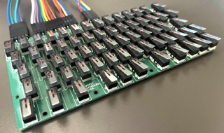

# Worst. Keyboard. Ever.

https://github.com/xunker/worst_keyboard_ever

It's a keyboard made from limit switches[^1]. Sorry.

## Parts

Part                      | Quantity | Notes
--------------------------|----------|------
[PCB](kicad)              | 1        | Using more than one is not recommended
Omron D2F-FL              | 66       | [^2]
1N4148 Diode              | 66       | SOT123 package recommended, but you can use LL34 (MiniMELF) if you hate yourself
2.54MM pin (male) headers | 23 pos   | Use whatever fits in the holes[^3]
0805 LED                  | 3        | Prefer the kind that light up; LED that don't light up aren't fun
0805 330 ohm resistor     | 3        | You'll learn to solder SMD components and you'll _like it_

Your microcontroller is not listed. Use whatever you like. There's [QMK firmware](qmk_firmware/keyboards/wke_66/) for the Pi Pico if you want it.

## Matrix

| row/col | 0    | 1   | 2   | 3    | 4    | 5    | 6    | 7   | 8   | 9   | 10  | 11   | 12   | 13    |
|---------|------|-----|-----|------|------|------|------|-----|-----|-----|-----|------|------|-------|
| 0       | esc  | 1   | 2   | 3    | 4    | 5    | 6    | 7   | 8   | 9   | 0   | -    | =    | bksp  |
| 1       | tab  | q   | w   | e    | r    | t    | y    | u   | i   | o   | p   | [    | ]    | \     |
| 2       | cap  | a   | s   | d    | f    | g    | h    | j   | k   | l   | ;   | '    | ent  | ---   |
| 3       | shft | z   | x   | c    | v    | b    | n    | m   | ,   | .   | /   | shft | up   | fn    |
| 4       | ctrl | win | alt |  --- | spc1 | spc2 | spc3 | --- | --- | alt | app | left | down | right |

## Firmware

There is QMK firmware available, targeting the Raspberry Pi Pico (RP2040). Find it in the [qmk_firmware](qmk_firmware/keyboards/wke_66/) directory.

# Useless Questions

## Why?

Because I needed **one** switch, but it was cheaper to buy a whole gross of them.

## The switches are too close together

I recommend installing smaller fingers.

## I've used worse keyboards than this!

1) "Worst. Keyboard. Ever." is a product/marketing name.
2) No you haven't.

## A Scroll Lock LED? Really?

Don't worry about it. No one in the history of the world has **ever** used Scroll Lock. No, not even _that one guy from the internet_, he's lying.

## Is there an ISO version?

Assuming drills exist, yes.

## Your soldering is terrible!

Wrong, _MY_ soldering is AWESOME. My _cat's_ soldering is terrible.

Note: The cat hair seen in the photos is __not included__.

# License

[CC BY-NC-SA 4.0](LICENSE)

[^1]: Variously called "limit switches", "lever switches", or "detect switches".

[^2]: Be honest, you're not going to use _real_ Omron switches, are you? You're going to use some knock-off, admit it.

[^3]: That's what she said.

